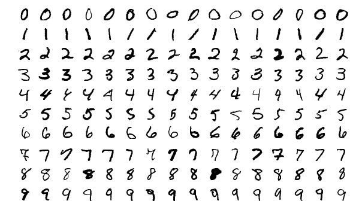

# C++ MNIST Neural Network

A simple C++ neural network for classifying MNIST digits, featuring custom layers, activation functions, and model saving/loading.

Test Accuracy Achieved by Neural Network: 98.15%



## Features

- **Custom Layers:** Fully connected (Dense) layers
- **Activation Functions:** ReLU and Softmax
- **Optimizer:** Stochastic Gradient Descent (SGD)
- **Model Serialization:** Save and load trained models
- **Modes:** Train, Evaluate, Inference

## Requirements

- C++11 or higher
- `g++` compiler
- MNIST dataset files placed in `data/` directory:
  - `train-images.idx3-ubyte`
  - `train-labels.idx1-ubyte`
  - `t10k-images.idx3-ubyte`
  - `t10k-labels.idx1-ubyte`

## Installation

1. **Clone the Repository:**

   ```bash
   git clone https://github.com/tle8ball/mnist-neural-network.git
   cd mnist-neural-network
   ```

2. **Compile the Program:**
   ```bash
   g++ -Wall -std=c++11 -fopenmp -O3 main.cpp src/layers.cpp src/loss.cpp src/optimizer.cpp src/mnist_loader.cpp src/neural_network.cpp src/utils.cpp -o mnist_nn.exe
   ```

## Usage

Run the program in one of the following modes:

- **Train the Model:**

  ```bash
  ./mnist_nn.exe train
  ```

- **Evaluate the Model:**

  ```bash
  ./mnist_nn.exe evaluate
  ```

- **Perform Inference:**
  ```bash
  ./mnist_nn.exe inference
  ```

## Performance

- Multithreading: The program is optimized to run multithreaded on the CPU using OpenMP, effectively utilizing multiple cores to accelerate training and inference.
- Accuracy: Achieves an accuracy of 98.15% on the MNIST test dataset, demonstrating its effectiveness in digit classification tasks.

**CPU Utilization:**

- During training and evaluation, multiple CPU cores are actively utilized, leading to faster computation times compared to single-threaded implementations.
